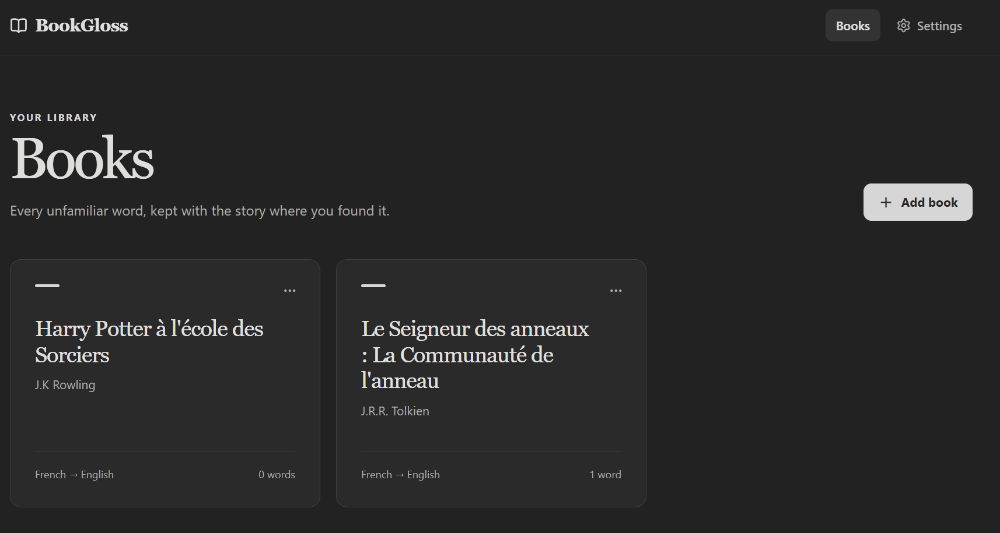
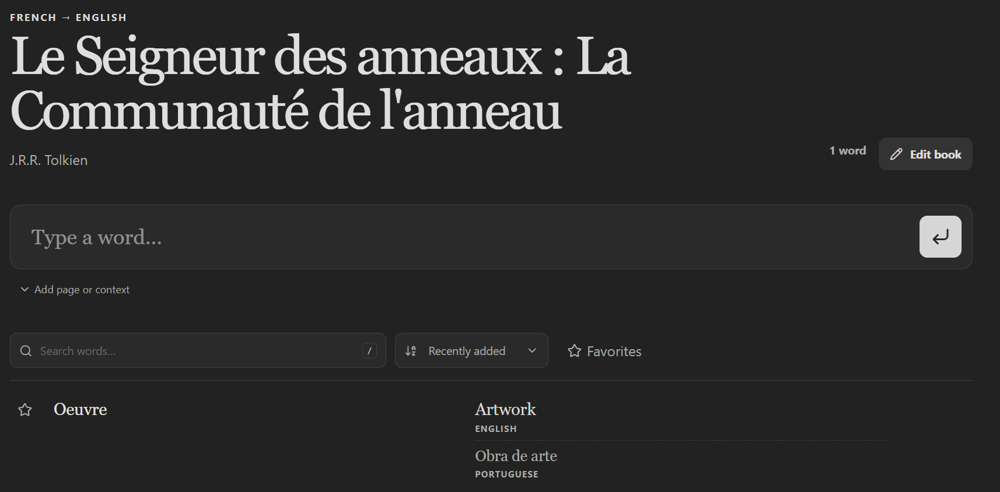

# BookGloss

BookGloss is a small, self-hosted vocabulary app for readers. Add an unfamiliar word while reading and it is translated, saved under the book where you found it, and ready to review later.

It is designed for personal use on a trusted network. Translation requires access to the Google Cloud Translation API.

> [!WARNING]
> BookGloss has **no built-in authentication or user accounts**. Anyone who can reach the port can read and edit everything. Run it on a private LAN only, or put your own access control in front of it (for example Cloudflare Access, Authelia, Tailscale, or an authenticated reverse proxy). Never expose it directly to the internet.

## Screenshots

<p align="center">
  
  
</p>

## Features

- Organizes vocabulary by book and language pair
- Translates words as you add them and keeps the input ready for the next word
- Counts repeated words instead of creating duplicates
- Supports one or two displayed translations, translation history, and manual edits
- Stores optional page numbers and context
- Includes favorites, search, filtering, and sorting
- Offers 62 languages and light, dark, or system themes
- Runs in one Docker container with persistent SQLite storage

## Run with Docker

You will need Docker with Compose and a Google Cloud project with the Cloud Translation API enabled.

```bash
git clone https://github.com/fernando-granco/BookGloss.git
cd BookGloss
cp .env.example .env
```

For the simplest setup, create an API key, restrict it to the Cloud Translation API, and add it to `.env`:

```env
GOOGLE_TRANSLATE_API_KEY=your-restricted-api-key
```

Then start BookGloss:

```bash
docker compose up -d --build
```

Open [http://localhost:3000](http://localhost:3000). Database migrations run automatically when the container starts.

## Configuration

An API key is sufficient for most installations. Service-account authentication is also supported by setting both `GOOGLE_CLOUD_PROJECT_ID` and `GOOGLE_CLOUD_CREDENTIALS_BASE64` instead of `GOOGLE_TRANSLATE_API_KEY`.

| Variable | Default | Description |
| --- | --- | --- |
| `PORT` | `3000` | Port exposed by Docker Compose |
| `GOOGLE_TRANSLATE_API_KEY` | empty | Restricted Google Cloud Translation API key |
| `GOOGLE_CLOUD_PROJECT_ID` | empty | Google Cloud project ID for service-account authentication |
| `GOOGLE_CLOUD_CREDENTIALS_BASE64` | empty | Base64-encoded service-account JSON |

To encode a service-account file:

```powershell
[Convert]::ToBase64String([IO.File]::ReadAllBytes("service-account.json"))
```

```bash
base64 < service-account.json | tr -d '\n'
```

Keep `.env` and credential files out of version control.

## Data and updates

Docker Compose stores the SQLite database in the `bookgloss-data` volume. Rebuilding or replacing the container keeps your data, but `docker compose down -v` permanently removes it.

To create a consistent backup, briefly stop the app and copy the database:

```bash
mkdir -p backups
docker compose stop bookgloss
docker cp bookgloss:/app/data/vocabulary.db backups/vocabulary-$(date +%Y-%m-%d).db
docker compose start bookgloss
```

To restore a backup:

```bash
docker compose stop bookgloss
docker cp backups/vocabulary-2026-08-15.db bookgloss:/app/data/vocabulary.db
docker compose start bookgloss
```

To update BookGloss, back up the database first, then rebuild from the latest code:

```bash
git pull
docker compose up -d --build
```

## Notes

- New installations start with French to English and enable Portuguese, English, French, and Spanish. Other supported languages can be enabled in Settings.
- Words submitted for translation are sent to Google Cloud Translation. Page numbers, context, books, and saved translations stay in the local SQLite database.
- BookGloss has no accounts, built-in authentication, flashcards, or spaced repetition.

## Security

BookGloss has no built-in authentication. Keep it on a private network or place it behind a trusted VPN or authenticated reverse proxy. See [SECURITY.md](SECURITY.md) for vulnerability reporting.

## License

BookGloss is available under the [MIT License](LICENSE).
